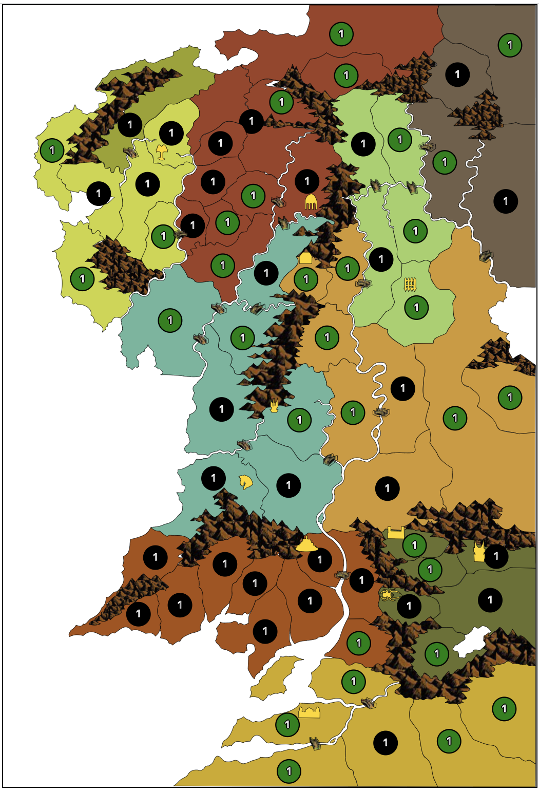

# Lord of the Rings Risk 

An online multiplayer implementation of the board game 'Lord of the Rings Risk'.

Built using React.js with Typescript for the frontend and Python/Django for the server.



### Prerequisites
This project requires TypeScript, Python3 and Docker to run locally. 

### Running Locally

Frontend: 
Create a `.env` file inside the frontend directory with the following property:
```
REACT_APP_SERVER_URL="localhost:8000"
```

Inside the frontend directory run:
```zsh
npm install
npm start
```

Server:
Inside the server directory run:
```zsh
docker-compose build
docker-compose up
```

The app will then be viewable at [http://localhost:3000](http://localhost:3000) 


### Running Tests
Frontend:
Inside the frontend directory run:
```zsh
npm run test
```

Server
Inside the server directory set up and activate the python virtual environment:
```zsh
python3 -m venv venv
source venv/bin/activate
pip3 install -r requirements.txt
```

Then execute the tests with:
```zsh
python3 run_tests.py
```
